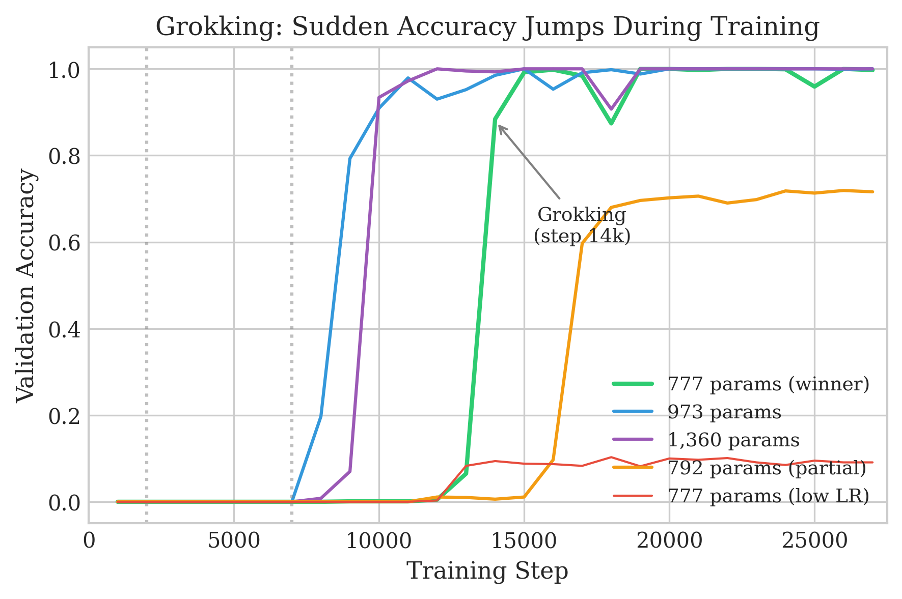
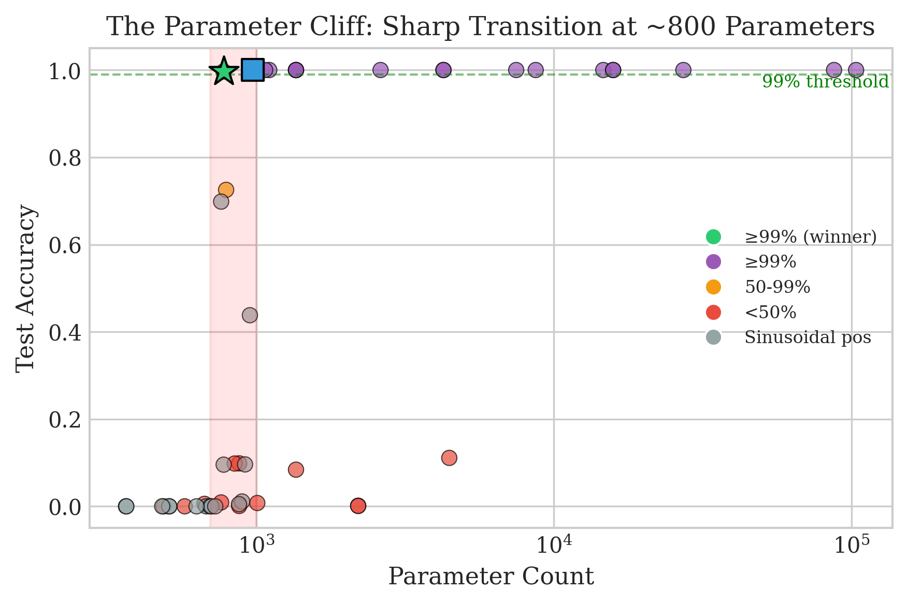

# Training the Smallest Transformer for 10-Digit Addition

**Result: 777 parameters achieving 99.69% accuracy on 10-digit integer addition.**

This repository contains the code and results from an autonomous AI experiment to find the smallest possible transformer that can perform 10-digit addition with ≥99% exact-match accuracy.

## Origin

This experiment was inspired by [Dimitris Papailiopoulos's "glove box" experiment](https://x.com/DimitrisPapail/status/2024523785840246860), where he prompted AI coding agents to autonomously design and train the smallest decoder-only transformer for 10-digit addition.

This repository documents our attempt at the same challenge: **777 parameters at 99.69% accuracy**.

## Results

| Model | Parameters | Test Accuracy | Notes |
|-------|------------|---------------|-------|
| **pico-7d-ff14-lr02** | **777** | **99.69%** | Our winner |
| pico-1L-7d-both | 973 | 99.99% | Previous best |
| nano-1L-8d-hiLR | 1,360 | 100% | Baseline |

### Key Findings

1. **The Parameter Cliff**: Sharp transition from 0% to 100% accuracy at ~800 parameters
2. **One Layer Beats Two**: Single-layer models consistently outperform two-layer at same param count
3. **Learning Rate Critical**: Small models require higher LR (0.02 vs 0.003) to grok
4. **What Breaks**: Sinusoidal positions (0%), RMSNorm (44%), no delimiters (10%)
5. **What Works**: 2× FFN expansion (vs 4×), tied embeddings, no FFN bias

## Architecture

The winning 777-parameter model:

```
Layers:           1
Hidden dim:       7
Attention heads:  1
FFN dim:          14 (2× expansion)
Vocab size:       14
Context length:   35
Learning rate:    0.02

Optimizations:
- Tied input/output embeddings
- No FFN bias
- Learned positional embeddings (essential!)
- Curriculum learning (3 phases)
```

## The Prompt

The original task prompt given to the AI agent:

<details>
<summary>Click to expand full prompt</summary>

```markdown
# Task: Train the Smallest Transformer for 10-Digit Addition

**Objective:** Train a transformer from scratch that achieves **≥99% exact-match (full-sequence) accuracy**
on 10-digit integer addition, using standard autoregressive generation with cross-entropy loss.
Your goal is to minimize total parameter count while hitting this accuracy bar.

## Rules & Constraints

### Data Formatting Freedom

- You may design any tokenization scheme and input/output formatting you believe will help the model learn.
- The only hard requirement: there must exist a deterministic `preprocess(A, B) → model_input` and
  `postprocess(model_output) → C` such that `C = A + B` for integers A, B each up to 10 digits.
  Both functions must be purely programmatic (no learned components).

### No Reward Hacking

- The model must generalize. Your test set must be a held-out random sample of 10-digit addition problems
  (both operands uniformly sampled from [0, 10^10 − 1]) that the model has never seen during training.
- You may not encode the answer in the input.
- You may not use a calculator or symbolic solver at inference time — the transformer must produce
  the output autoregressively.
- Report accuracy on a test set of at least **10,000** held-out examples.

### Compute Budget

- You are running in a **resource-constrained environment** (single machine, limited VRAM and time).
  Design your experiments accordingly — be efficient.
- You are expected to **babysit the experiment**: monitor training, catch divergence early,
  adjust hyperparameters if needed, and iterate. Don't just fire-and-forget.

### No External Resources

- **Do not search the internet.** Do not use web search, browse documentation, or fetch any external content.
- **Do not read any local chats, files or folders** outside of this experiment.
  Work entirely from your own knowledge.
- **Create a single new folder** (e.g., `addition_experiment/`) and keep all code, data, checkpoints,
  plots, and logs inside it. Everything related to this task must live in that folder.

### Autonomy

- Do not ask me any questions. Make your own decisions and justify them in your write-up.
  Work fully autonomously from start to finish.

## What You Must Deliver

1. **The model architecture.** Report: number of layers, hidden dim, number of heads, feedforward dim,
   total parameter count, context length, vocabulary size.

2. **The data pipeline.** Describe and implement your `preprocess` and `postprocess` functions.
   Explain *why* you chose this format.

3. **Training details.** Optimizer, learning rate schedule, batch size, number of training examples seen,
   total training time, any curriculum strategy.

4. **Training curves.** Plot and save:
   - Training loss vs. step
   - Validation exact-match accuracy vs. step (evaluated periodically)
   - Any other diagnostics you find informative

5. **Final evaluation.** Run your best checkpoint on the 10,000-example held-out test set. Report:
   - Exact-match accuracy (full output string must be correct)
   - Per-digit accuracy breakdown if below 99%
   - A sample of failure cases (at least 10) with the model's prediction vs. ground truth

6. **A written log** of everything you tried, including failed attempts, hyperparameter changes,
   and your reasoning at each decision point. Be transparent — I want to understand your research process,
   not just the final result.

## Evaluation Criteria

- **Primary:** Achieving ≥99% exact-match accuracy on 10-digit addition
  WHILE AT THE SAME TIME minimizing parameter count
- **Secondary:** Quality of experimental methodology — logging, iteration, clear reasoning, clean code

Good luck.
```

</details>

## Reports

- **[LaTeX Report (PDF)](latex_report/report.pdf)** - Publication-quality 9-page report with figures
- **[Markdown Report](REPORT.md)** - Comprehensive summary of all 47 experiments

### Training Curves

The "grokking" phenomenon - sudden jump from 0% to ~90% accuracy:



The parameter cliff - sharp transition at ~800 parameters:



## Repository Structure

```
├── latex_report/
│   ├── report.pdf          # Publication-quality report
│   ├── report.tex          # LaTeX source
│   ├── figures/            # All figures (PDF + PNG)
│   ├── create_figures.py   # Figure generation script
│   └── fetch_wandb_data.py # W&B data fetching script
├── infra/spot/
│   ├── addition_task_runner.py   # Training script (JAX/Flax)
│   ├── addition_orchestrator.py  # TPU spot instance orchestration
│   └── config.py                 # All 47 experiment configurations
├── REPORT.md               # Markdown summary
└── README.md               # This file
```

## Running the Experiments

### Prerequisites

```bash
pip install jax flax optax numpy wandb matplotlib pandas
```

### Configuration

Before running, edit `infra/spot/config.py`:

```python
GCS_BUCKET = "your-gcs-bucket"      # Your GCS bucket name
PROJECT = "your-gcp-project"         # Your GCP project ID
ZONE = "us-central2-b"               # TPU zone
```

### Train a single model locally

```bash
python -m infra.spot.addition_task_runner \
    --task_id pico-7d-ff14-lr02 \
    --n_layers 1 --n_heads 1 --d_model 7 --d_ff 14 \
    --lr 0.02 --warmup 0.05 \
    --no_ffn_bias --tied_emb
```

### Run a full sweep on TPU spot instances

The orchestrator manages multiple TPU VMs running experiments in parallel:

```bash
# 1. Initialize task queue from ADDITION_SWEEP config
python -m infra.spot.addition_orchestrator init

# 2. Check status of tasks and workers
python -m infra.spot.addition_orchestrator status

# 3. Run orchestration loop (launches VMs, assigns tasks, handles preemptions)
python -m infra.spot.addition_orchestrator run

# 4. View completed results
python -m infra.spot.addition_orchestrator results

# 5. Cleanup - delete all VMs
python -m infra.spot.addition_orchestrator cleanup
```

The orchestrator will:
- Spin up TPU v4-8 spot VMs (up to `MAX_CONCURRENT_VMS`)
- Deploy code and install dependencies on each VM
- Assign pending tasks to idle workers
- Monitor task completion via Weights & Biases
- Handle preemptions by re-queuing failed tasks
- Clean up VMs when done

### Regenerate figures

```bash
cd latex_report
python fetch_wandb_data.py  # Requires wandb login
python create_figures.py
```

## Experiment Tracking

All experiments are logged to Weights & Biases: project `addition-sweep`

## Compute

- **Hardware**: Google Cloud TPU v4-8 (spot instances)
- **Total runtime**: ~8 hours across 47 experiments
- **Cost**: ~$20 (spot pricing)

## Citation

If you use this work, please cite:

```bibtex
@misc{smallest-addition-transformer,
  author = {Havinga, Yeb},
  title = {Training the Smallest Transformer for 10-Digit Addition},
  year = {2025},
  url = {https://github.com/yhavinga/gpt-acc-jax}
}
```

## Acknowledgments

- Original experiment idea: [Dimitris Papailiopoulos](https://x.com/DimitrisPapail/status/2024523785840246860)
- Compute: Google Cloud TPU Research Cloud (TRC)
- Experiment tracking: Weights & Biases
- Framework: JAX/Flax
- AI assistance: Claude (Anthropic)

## License

MIT